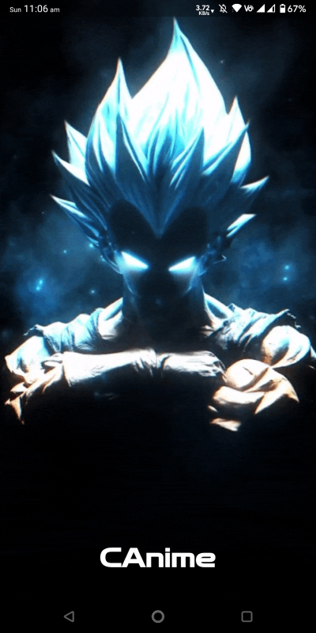
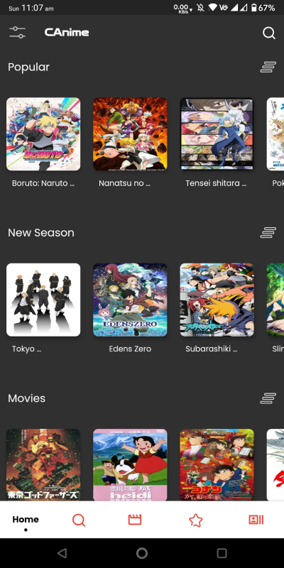
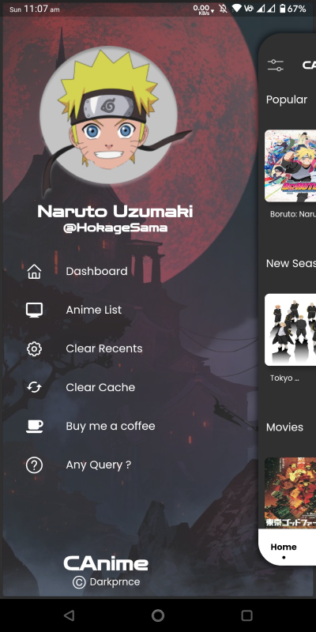
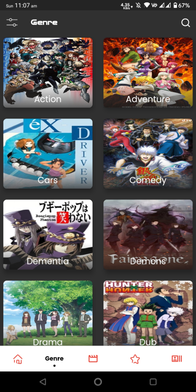
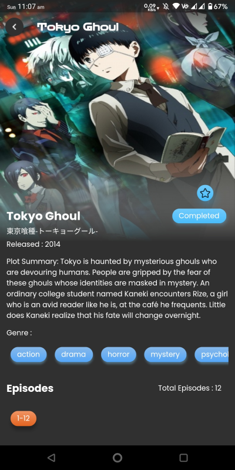
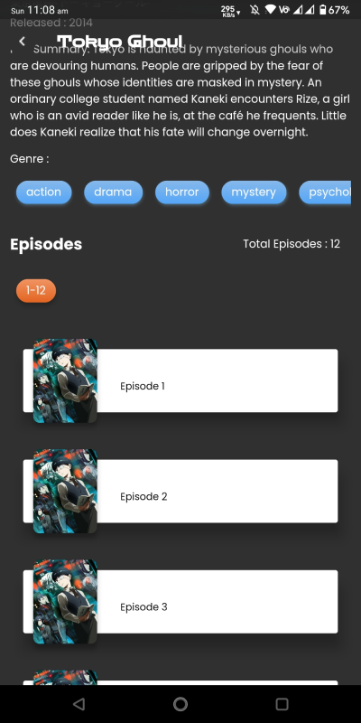
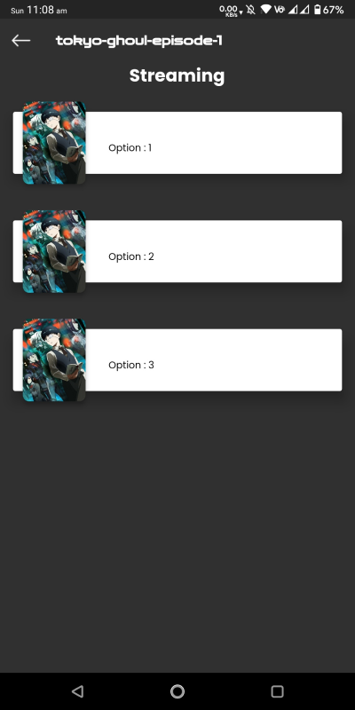
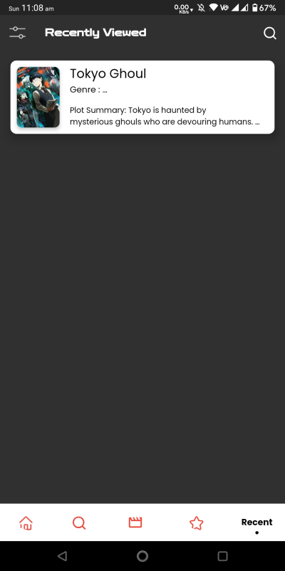

 
<h2 align="center"><b>CAnime</b></h2>
<h4 align="center">An Android app to watch anime on your phone for free.</h4>

 

<h3 align="center">**Star :star:  this repo to show your support and it really does matter!** :clap:</h4>

## Screenshots

## Description

CAnime parses website data and filter required info and links, and present the data in easy and interactive way. The app doesn't require Sign-up to use it.
I hope you will enjoy this app.

### Features

* Search Anime
* Recently Added Episodes
* Popular Animes
* Anime Movies
* Watch Progress
* Add To Favorites
* Auto Quality for Video Playback
* Ads Free For Full Day Offer
* Dark Theme
* Interactive and Easy UI.

### Coming Features

* Directly skip to next/previous episode from player.
* More Player Controls
* … and many more

### Technologies used
* Flutter
* Dart

## Contribution
Your ideas, design changes, or any help is always welcome. The more is contribution the better it gets.

 
